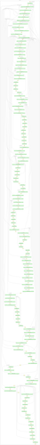
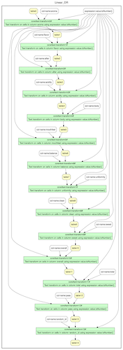
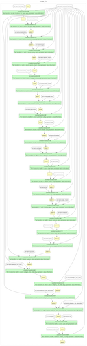

***

```{r setup, echo=FALSE, message=FALSE, warning=FALSE}
options(scipen = 1, digits = 4, width = 80, fig.align = "center")
library(httr)
library(readr)
library(tibble)
library(jsonlite)
library(tidyverse)
library(lubridate)
library(RSQLite)
library(knitr)
library(kableExtra)
set.seed(1337)
```

```{r echo=FALSE, ref.label="setup_retrieve_data", eval=TRUE}
```

```{r echo=FALSE, ref.label="setup_openrefine_retrieve_data", eval=TRUE}
```

```{r read_data, echo=FALSE, eval=TRUE, message=FALSE, warning=FALSE}
coffees_df <- read_csv(coffees_file_path)
grades_df <- read_csv(coffee_grades_file_path)
greens_df <- read_csv(coffee_greens_file_path)
```

## Introduction and Overview

The Coffee Quality Institute[^1] (CQI) is an international non-profit organization dedicated to improving the quality of coffee. As such, they provide tools and support for people that lack the understanding on how to measure the quality of the coffee they produce. They have compiled and shared their database[^2] of Q graded arabica[^3] and robusta[^4] coffees which contain details about the producer, its farm, the coffee cupping scores and green coffee analysis (GCA).

As a use case, assume we want to open up our coffee sales business from wholesale to retail. In order to do this we want to leverage the data from CQI, our primary coffee provider, to implement a feature in our platform to recommend coffee. Since our target market consists of specialty coffee enthusiasts, roasters and baristas we are able to construct an advanced coffee profile with their preferences. For this to work, we must clean the CQI data and then leverage it to build a recommender system that will proactively perform these recommendations over time.

Unlike with regular coffee which is normally dark roasted to the maximum level possible, in specialty coffee the quality matters a lot more since the flavors and notes are obtained through a light roast. However, depending on preference, one might find that one is willing to sacrifice different types of quality for price (e.g. you don't care as much about aroma but you want flavor and find the presence of slight insect issues or broken beans irrelevant).

In order to make this data fit for use, we will focus on accuracy, completeness and consistency of the measured coffee quality entries. Specifically, we would like to focus on the macro and micro-location details, coffee details and quality which consists of grading/cupping scores as well as green coffee analysis.

The data is sufficiently clean and granular enough that we can correlate the farm and coffee lot to its grading/cupping scores and green coffee analysis. It can also allow us to perform analysis at the farm, producer or regional level with the intent of uncovering trends at the harvest year. With enough historical data, it can help identify patterns and predict quality based on any of these parameters. Adding other sources of data (e.g. historical weather conditions, air moisture, etc...), can potentially improve and make these predictions even more accurate.

## Initial assessment of the dataset

The dataset was [acquired](#retrieve_data) using CQI's undocumented API, then it [normalized](#normalize_data) and [saved](#normalize_data). At the time of obtaining this data there were only 3 robusta coffee records. Therefore, the focus was determined to fall fully on arabica coffees. In general the data is divided into three different areas and therefore files: coffee information, grades/cupping scores and green analysis.

### Coffee information

The coffee information subset consists of `r nrow(coffees_df)` observations and has the following structure:

```{r show_coffees_data, echo=FALSE, comment=NA}
str(tibble::as_tibble(coffees_df), give.attr = FALSE, strict.width = "cut")
```

### Grades/Cupping scores

The grades/cupping scores subset consists of `r nrow(grades_df)` observations and has the following structure:

```{r show_coffee_grades_data, echo=FALSE, comment=NA}
str(tibble::as_tibble(grades_df), give.attr = FALSE, strict.width = "cut")
```

### Green analysis

The green analysis subset consists of `r nrow(greens_df)` observations and has the following structure:

```{r show_coffee_green_data, echo=FALSE, comment=NA}
str(tibble::as_tibble(greens_df), give.attr = FALSE, strict.width = "cut")
```

```{r remove_data, echo=FALSE, eval=TRUE}
rm(coffees_df)
rm(grades_df)
rm(greens_df)
```

## Data Cleaning methods and process

### Data cleaning with OpenRefine

```{r read_openrefine_data, echo=FALSE, eval=TRUE, message=FALSE, warning=FALSE}
openrefine_path <- file.path(data_path, "openrefine")
coffees_or_file_path <- file.path(openrefine_path, "coffees.csv")
coffee_greens_or_file_path <- file.path(openrefine_path, "coffee_greens.csv")
coffee_grades_or_file_path <- file.path(openrefine_path, "coffee_grades.csv")
coffees_or_df <- read_csv(coffees_or_file_path)
grades_or_df <- read_csv(coffee_grades_or_file_path)
greens_or_df <- read_csv(coffee_greens_or_file_path)
```

The coffee information dataset has several issues which were addressed using OpenRefine[^5]. The operation history has been stored in the supplemental information as JSON files (`*_recipe.json`) under the `data/openrefine` directory.

#### Coffee information

Corresponding to text columns the following was addressed: spelling mistakes/typos, inconsistency between abbreviation vs. no abbreviation, text casing mismatch, and extra spaces (leading, trailing and in between). These issues were present in the following columns of interest: `country_title`, `state`, `region`, `producer`, `name`, `mill`, `farm`, `company`, `city`, `carrier` and `buyer`. Date columns `completed_desc` and `created_desc` were also standardized to use ISO. Across the board, `NA` and `None` are used to convey the same meaning and were standardize to use either empty or `None` (one or the other).

#### Grades/Cupping scores

No major changes were performed on this subset of the data.

#### Green analysis

No major changes were performed on this subset of the data.

### Data cleaning with R

More transformations were performed using `R` which did not fit well using OpenRefine.

#### Coffee information

```{r echo=FALSE, ref.label="normalize_altitude", eval=TRUE}
```

```{r echo=FALSE, ref.label="standardize_altitude", eval=TRUE}
```

```{r echo=FALSE, ref.label="standardize_weight", eval=TRUE}
```

```{r echo=FALSE, ref.label="normalize_green_pass", eval=TRUE}
```

Some altitudes are ranges instead of units: **1500-2000**. Due to this, we [normalized](#altitude_normalization) it by calculating the mid-point between the range, and converted the values to numeric. Two different types of altitude units were used: feet (*ft*) and meters (*m*). These were [standardized](#altitude_unit_standardization) by converting feet to meters. As a point in hand, two different types of weight units were used: pounds (*lbs*) and kilograms (*kg*). These were [standardized](#altitude_unit_standardization) by converting pounds to kilograms. Finally, the green analysis pass column `green_pass` was [normalized](#green_pass_normalization) from numeric to logical.

#### Grades/Cupping scores

```{r echo=FALSE, ref.label="normalize_pass", eval=TRUE}
```

The `pass` column was [normalized](#pass_normalization) from numeric to logical.

#### Green analysis

No major changes were performed on this subset of the data.

```{r echo=FALSE, ref.label="setup_clean_data", eval=TRUE}
```

```{r echo=FALSE, ref.label="save_clean_data", eval=TRUE}
```


### Relational schema and integrity constraint checks

```{r echo=FALSE, ref.label="setup_and_open_database", eval=TRUE}
```

Using the clean data a SQLite database was [setup and opened](#setup_and_open_database) and each data subset [written to](#write_data_and_list_tables) a corresponding table with the same name. In order to address violation constraints, rows corresponding to these were [removed](#remove_ic_violations).

#### Coffee completion date should be after creation {#content_ic_coffee_completion_date}

In denial form, [we report all the integrity constraint violations](#ic_coffee_completion_date) for coffee entries which completion date is before its creation date:

```{r echo=FALSE, ref.label="ic_coffee_completion_date", eval=TRUE}
```
```{r echo=FALSE, eval=TRUE}
kable(result) %>% kable_styling(position = "center")%>% row_spec(0, bold = TRUE)
```

This could mean that the cupping score/grading was finished before the entry was created within the system. For this reason, we keep the entries.

#### Coffee altitude should be larger or equal than zero

In denial form, [we report all the integrity constraint violations](#ic_coffee_altitude) for coffee entries that have an altitude less or equal than zero:

```{r echo=FALSE, ref.label="ic_coffee_altitude", eval=TRUE}
```
```{r echo=FALSE, eval=TRUE}
kable(result) %>% kable_styling(position = "center") %>% row_spec(0, bold = TRUE)
```

No issues were found.

#### Coffee cupping scores/grades should be between zero and ten

In denial form, [we report all the integrity constraint violations](#ic_coffee_grades) for coffee entries that have grades less than zero or larger than ten:

```{r echo=FALSE, ref.label="ic_coffee_grades", eval=TRUE}
```
```{r echo=FALSE, eval=TRUE}
kable(result) %>% kable_styling(position = "center") %>% row_spec(0, bold = TRUE)
```

No issues were found.

#### Coffee cupping scores/grades should be have approximate total scores

In denial form, [we report all the integrity constraint violations](#ic_coffee_grades_total) for coffee grades that do not have a close enough total score:

```{r echo=FALSE, ref.label="ic_coffee_grades_total", eval=TRUE}
```
```{r echo=FALSE, eval=TRUE}
kable(result) %>% kable_styling(position = "center") %>% row_spec(0, bold = TRUE)
```

No issues were found.

#### Coffee cupping scores/grades should correctly report passing vs. failing

In denial form, [we report all the integrity constraint violations](#ic_coffee_grades_pass) for coffee grades that do not mark coffees with a score of larger than or equal to `80` as pass, otherwise fail:

```{r echo=FALSE, ref.label="ic_coffee_grades_pass", eval=TRUE}
```
```{r echo=FALSE, eval=TRUE}
kable(result) %>% kable_styling(position = "center") %>% row_spec(0, bold = TRUE)
```

No issues were found.

#### Coffee green analysis count should be larger than zero

In denial form, [we report all the integrity constraint violations](#ic_coffee_greens) for coffee green analysis that have grades less than zero:

```{r echo=FALSE, ref.label="ic_coffee_greens", eval=TRUE}
```
```{r echo=FALSE, eval=TRUE}
kable(result) %>% kable_styling(position = "center") %>% row_spec(0, bold = TRUE)
```

No issues were found.

#### Coffee green analysis category totals should equal {#content_ic_coffee_greens_total}

In denial form, [we report all the integrity constraint violations](#ic_coffee_greens_total) for coffee green analysis whose totals per category do not match the manually calculated values:

```{r echo=FALSE, ref.label="ic_coffee_greens_total", eval=TRUE}
```
```{r echo=FALSE, eval=TRUE}
ic_violation_ids_to_remove <- c(ic_violation_ids_to_remove, result$random_id)
kable(result) %>% kable_styling(position = "center") %>% row_spec(0, bold = TRUE)
```

In this case the manually calculated total amounts (`one_total` and `two_total`) are double ($2x$) the ones reported by the data set. This could be caused by a either an ETL process gone wrong or an incorrect data entry so it will be removed from the data set.

#### Coffee green analysis category defects should equal {#content_ic_coffee_greens_defect}

In denial form, [we report all the integrity constraint violations](#ic_coffee_greens_defect) for coffee green analysis whose calculated defects per category do not match the manually calculated ones:

```{r echo=FALSE, ref.label="ic_coffee_greens_defect", eval=TRUE}
```
```{r echo=FALSE, eval=TRUE}
ic_violation_ids_to_remove <- c(ic_violation_ids_to_remove, result$random_id)
kable(result) %>% kable_styling(position = "center") %>% row_spec(0, bold = TRUE)
```

As in the case before for the same entry, we see that the manually calculated defect amounts (`one_defects` and `two_defects`) are larger by two times plus one ($2x + 1$) the reported value by the data set. This could be caused by a either an ETL process gone wrong or an incorrect data entry so it will be removed from the data set.

#### Every coffee entry should have a at least one set of grades/cupping scores and green analysis

In denial form, [we report all the integrity constraint violations](#ic_coffee_at_least_one) for coffee entries that do not exist in the grades/cupping scores and green analysis subset when they do within the coffee information:

##### Grades/cupping scores

```{r echo=FALSE, ref.label="ic_coffee_at_least_one_grades", eval=TRUE}
```
```{r echo=FALSE, eval=TRUE}
ic_violation_ids_to_remove <- c(ic_violation_ids_to_remove, result$random_id)
kable(result) %>% kable_styling(position = "center") %>% row_spec(0, bold = TRUE)
```

##### Green analysis

```{r echo=FALSE, ref.label="ic_coffee_at_least_one_greens", eval=TRUE}
```
```{r echo=FALSE, eval=TRUE}
ic_violation_ids_to_remove <- c(ic_violation_ids_to_remove, result$random_id)
kable(result) %>% kable_styling(position = "center") %>% row_spec(0, bold = TRUE)
```

In this case we are missing an entry in both. It could mean that it still has not been added and/or reviewed. These entries will be removed from the data set.

#### Every coffee entry should have at most one set of grades/cupping scores and green analysis

In denial form, [we report all the integrity constraint violations](#ic_coffee_at_most_one) for coffee entries that have more than one entries for the grades/cupping scores or green analysis subset:

##### Grades/cupping scores

```{r echo=FALSE, ref.label="ic_coffee_at_most_one_grades", eval=TRUE}
```
```{r echo=FALSE, eval=TRUE}
kable(result) %>% kable_styling(position = "center") %>% row_spec(0, bold = TRUE)
```

##### Green analysis

```{r echo=FALSE, ref.label="ic_coffee_at_most_one_greens", eval=TRUE}
```
```{r echo=FALSE, eval=TRUE}
kable(result) %>% kable_styling(position = "center") %>% row_spec(0, bold = TRUE)
```

No issues were found.

```{r echo=FALSE, eval=TRUE}
dbDisconnect(connection)
```

```{r echo=FALSE, ref.label="read_clean_data", eval=TRUE, message=FALSE, warning=FALSE}
```

```{r echo=FALSE, ref.label="setup_ic_violation_clean_data", eval=TRUE}
```

```{r echo=FALSE, ref.label="remove_ic_violations", eval=TRUE}
```

```{r echo=FALSE, ref.label="save_final_clean_data", eval=TRUE}
```

\pagebreak

## Data Cleaning Results

In order to understand the above process and summarize the data cleaning results, diagrams and changes summaries per data file were constructed.

### Conceptual workflows

A [retrieve and clean workflow](#retrieve_and_clean_workflow) was manually created using YesWorkflow[^6] and is provided as supplemental information as `workflow/coffee.yw`. Following are multiple visualization levels of it.

#### Overview diagram


\pagebreak

#### Retrieve, save and normalize coffee data diagrams


\pagebreak

#### Clean data with OpenRefine diagrams


\pagebreak

#### Clean data with R diagrams


\pagebreak

#### Clean constraint violations diagrams


\pagebreak

### OpenRefine workflows

Using `or2yw`[^7] three YesWorklow files (included in the supplemental information under the `workflow/openrefine/*.yw` directory) were [automatically generated](#create_openrefine_yesworkflows) for the data cleaning changes performed using OpenRefine. Following, the [corresponding diagrams](#create_openrefine_diagrams) (one per each data file) are included.

\pagebreak

#### Coffee information diagram



\pagebreak

#### Grades/Cupping scores diagram



\pagebreak

#### Green analysis diagram



\pagebreak

### Changes summary {#changes_summary}

```{r echo=FALSE, ref.label="calculate_row_diff_summaries", eval=TRUE, warning=FALSE}
```

```{r echo=FALSE, ref.label="calculate_cell_diff_summaries", eval=TRUE, warning=FALSE}
```

Using `csvdiff`[^8], the changes performed in total and at each stage can be calculated per each file by the amount rows that were either removed, added and/or changed. For cell changes, `csv_diff`[^9] was used to complete the presented results.

#### By type and stages

The changes by type and stages can be [summarized](#calculate_row_diff_summaries) with the following tables.

##### Coffee information

##### Row changes

```{r coffee_information_row_results_summary, echo=FALSE}
kable(row_summaries[[1]]) %>% kable_styling(position = "center") %>% row_spec(0, bold = TRUE)
```

\pagebreak

##### OpenRefine cell changes

```{r coffee_information_openrefine_cell_results_summary, echo=FALSE}
kable(cell_summaries[[1]][[1]]) %>% kable_styling(position = "center") %>% row_spec(0, bold = TRUE)
```

\pagebreak

##### R cell changes

```{r coffee_information_r_cell_results_summary, echo=FALSE}
kable(cell_summaries[[1]][[2]]) %>% kable_styling(position = "center") %>% row_spec(0, bold = TRUE)
```

\pagebreak

##### Constraints cell changes

```{r coffee_information_constraints_cell_results_summary, echo=FALSE}
kable(cell_summaries[[1]][[3]]) %>% kable_styling(position = "center") %>% row_spec(0, bold = TRUE)
```

##### Grades/Cupping scores

```{r grading_cupping_scores_results_summary, echo=FALSE}
kable(row_summaries[[2]]) %>% kable_styling(position = "center") %>% row_spec(0, bold = TRUE)
```

##### OpenRefine cell changes

```{r grading_cupping_openrefine_cell_results_summary, echo=FALSE}
kable(cell_summaries[[2]][[1]]) %>% kable_styling(position = "center") %>% row_spec(0, bold = TRUE)
```

##### R cell changes

```{r grading_cupping_r_cell_results_summary, echo=FALSE}
kable(cell_summaries[[2]][[2]]) %>% kable_styling(position = "center") %>% row_spec(0, bold = TRUE)
```

##### Constraints cell changes

```{r grading_cupping_constraints_cell_results_summary, echo=FALSE}
kable(cell_summaries[[2]][[3]]) %>% kable_styling(position = "center") %>% row_spec(0, bold = TRUE)
```

##### Green analysis

```{r green_analysis_results_summary, echo=FALSE}
kable(row_summaries[[3]]) %>% kable_styling(position = "center") %>% row_spec(0, bold = TRUE)
```

##### OpenRefine cell changes

```{r green_analysis_openrefine_cell_results_summary, echo=FALSE}
kable(cell_summaries[[3]][[1]]) %>% kable_styling(position = "center") %>% row_spec(0, bold = TRUE)
```

##### R cell changes

```{r green_analysis_r_cell_results_summary, echo=FALSE}
kable(cell_summaries[[3]][[2]]) %>% kable_styling(position = "center") %>% row_spec(0, bold = TRUE)
```

##### Constraints cell changes

```{r green_analysis_constraints_cell_results_summary, echo=FALSE}
kable(cell_summaries[[3]][[3]]) %>% kable_styling(position = "center") %>% row_spec(0, bold = TRUE)
```

#### Totals

```{r echo=FALSE, ref.label="calculate_total_row_diff_summaries", eval=TRUE, warning=FALSE}
```

```{r echo=FALSE, ref.label="calculate_total_cell_diff_summaries", eval=TRUE, warning=FALSE}
```

The total row changes between when the data that was first downloaded and the final data cleaning changes can then be [summarized](#calculate_total_row_diff_summaries) as follows:

```{r total_row_results_summary, echo=FALSE}
kable(total_row_summaries) %>% kable_styling(position = "center") %>% row_spec(0, bold = TRUE)
```

Since only the coffee information ended with changes, the total cell changes between when the data that was first downloaded and the final data cleaning changes can then be [summarized](#calculate_total_cell_diff_summaries) as follows:

```{r total_cell_results_summary, echo=FALSE}
kable(total_cell_summaries[[1]]) %>% kable_styling(position = "center") %>% row_spec(0, bold = TRUE)
```

The difference files were also [calculated](#calculate_total_csv_diff_files) and are stored in the supplemental information under the `data/diff` directory.

## Conclusions and Future Work

From the [changes summary](#changes_summary), we can observe that we ended up modifying every single row corresponding to the coffee information using OpenRefine and R. On the other hand, very few modifications were performed on the grades/cupping scores and green analysis data files. This makes sense taking into consideration that the coffee information data contained many string entries while the grades/cupping scores contained primarily numeric values. Overall, the amount of changes with respect to the original data are substantial.

One major problem encountered early on was eagerly updating new data from the source. Initially we ran the data retrieval process to acquire the data from the web site frequently (since it was fully automated) because we believed it changed infrequently. However, that was not the case and therefore it was hard to establish a data cleaning loop during development since we ended up having to compensate for the updates as well. For this reason we decided to take a snapshot of the data (including date/time) and work offline.

With more time, we would have reached out to CQI and try to resolve someof the issues encountered in the data set. To start with, we assumed that it is possible to have a [completion date which is before their creation date](#content_ic_coffee_completion_date). This should be confirmed with them. Also, while all constraint violations were removed, some of these could have been fixed instead. Such is the case of [coffee greens total](#content_ic_coffee_greens_total) and [coffee greens defect](#content_ic_coffee_greens_defect). Finally, it would have been great to further clean the data to obtain the coordinates for the producers and have a better sense of location of the farms. Withit we could visually inspect the data in a more practical way.

\pagebreak

## Appendix

### Retrieve data {#retrieve_data}

```{r setup_retrieve_data, echo=TRUE, eval=FALSE}
create_date_marker_file <- function (file_path) {
  file_connection <- file(file_path)
  current_date <- strftime(now(), "%Y-%m-%dT%H:%M:%S%z")
  writeLines(current_date, file_connection)
  close(file_connection)
}

data_path <- "./data"
download_path <- file.path(data_path, "download")
coffees_object_file_path <- file.path(download_path, "coffees.rds")
coffee_details_object_file_path <- file.path(download_path, "coffee_details.rds")
coffees_file_path <- file.path(download_path, "coffees.csv")
coffee_grades_file_path <- file.path(download_path, "coffee_grades.csv")
coffee_greens_file_path <- file.path(download_path, "coffee_greens.csv")
coffee_date_file_path <- file.path(download_path, "coffees_date.txt")
coffee_details_date_file_path <- file.path(download_path, "coffee_details_date.txt")
```

```{r retrieve_data, echo=TRUE, eval=FALSE}
data_frame_from_list <- function (data) {
  normalized_values <- lapply(data, function (row) {
    row[sapply(row, is.null)] <- NA
    unlist(row)
  })
  data_matrix <- do.call("rbind", normalized_values)
  data_frame <- as.data.frame(data_matrix, stringsAsFactors = FALSE)
  data_frame
}

retrieve_coffees <- function (
  url = "https://database.coffeeinstitute.org/api/coffees/arabicaAjax",
  start = 0,
  length = 0) {
  body <- list(start = start, length = length)
  response <- POST(url, body = body, encode = "form")
  value <- content(response)
  data_frame <- data_frame_from_list(value$data)
  data_frame
}

retrieve_coffee_details <- function (identifier, base_url) {
  url <- file.path(base_url, identifier)
  response <- GET(url)
  value <- content(response)
  value
}

retrieve_details <- function (
  coffees_df,
  base_url = "https://database.coffeeinstitute.org/api/coffee/random") {
  identifiers <- as.numeric(coffees_df$random_id)
  details_list <- lapply(identifiers, function (identifier) {
    value <- retrieve_coffee_details(identifier, base_url)
    value
  })

  details_list
}

dir.create(data_path, showWarnings = FALSE)
dir.create(download_path, showWarnings = FALSE)
coffees_df <- retrieve_coffees()
saveRDS(coffees_df, file = coffees_object_file_path)
create_date_marker_file(coffee_date_file_path)
details <- retrieve_details(coffees_df)
saveRDS(details, file = coffee_details_object_file_path)
create_date_marker_file(coffee_details_date_file_path)
```

### Normalize data {#normalize_data}

```{r normalize_data, echo=TRUE, eval=FALSE}
normalize_details <- function (details_list) {
  grade_by_id <- lapply(details_list, function (details) {
    row <- NA
    if (is.list(details$grade)) {
      row <- details$grade
      row$random_id <- details$random_id
    }

    row
  })
  grades_df <- data_frame_from_list(grade_by_id)
  green_by_id <- lapply(details_list, function (details) {
    row <- NA
    if (is.list(details$green)) {
      row <- details$green
      row$random_id <- details$random_id
    }

    row
  })

  greens_df <- data_frame_from_list(green_by_id)
  list(grades = grades_df, greens = greens_df)  
}

normalize_grades <- function (grades_df) {
  grades_df <- grades_df[complete.cases(grades_df$random_id), ]
  grades_df
}

normalize_greens <- function (greens_df) {
  greens_df$pass <- as.logical(greens_df$pass)
  greens_column_names <- colnames(greens_df)
  remove <- c("color_title", "pass")
  integer_column_names <- greens_column_names[!(greens_column_names %in% remove)]
  for (column_name in integer_column_names) {
    greens_df[[column_name]] <- as.numeric(greens_df[[column_name]])
  }
  
  greens_df <- greens_df[complete.cases(greens_df$random_id), ]
  greens_df
}

normalized_details <- normalize_details(details)
grades_df <- normalize_grades(normalized_details$grades)
greens_df <- normalize_greens(normalized_details$greens)
```

### Save data {#save_csv_data}

```{r save_data, echo=TRUE, eval=FALSE}
write_csv(coffees_df, coffees_file_path)
write_csv(grades_df, coffee_grades_file_path)
write_csv(greens_df, coffee_greens_file_path)
rm(details)
rm(normalized_details)
```

### Coffee information altitude normalization {#altitude_normalization}

```{r normalize_altitude, echo=TRUE, eval=FALSE}
range_1500_2000 <- coffees_or_df$altitude == "1500-2000"
coffees_or_df$altitude[range_1500_2000] <- 1500 + ((2000 - 1500) / 2)
coffees_or_df$altitude <- as.numeric(coffees_or_df$altitude)
```

### Coffee information altitude unit standardization {#altitude_unit_standardization}

```{r standardize_altitude, echo=TRUE, eval=FALSE}
feet_units <- coffees_or_df$altitude_unit == "ft"
coffees_or_df$altitude[feet_units] <- coffees_or_df$altitude[feet_units] * 0.3048
```

### Coffee information weight unit standardization {#weight_unit_standardization}

```{r standardize_weight, echo=TRUE, eval=FALSE}
pound_units <- coffees_or_df$weight_unit == "lbs"
coffees_or_df$weight[pound_units] <- coffees_or_df$weight[pound_units] * 0.453592
```

### Coffee information green analysis pass normalization {#green_pass_normalization}

```{r normalize_green_pass, echo=TRUE, eval=FALSE}
yes <- coffees_or_df$green_pass == "Y"
no <- coffees_or_df$green_pass == "N"
coffees_or_df$green_pass[yes] <- "TRUE"
coffees_or_df$green_pass[no] <- "FALSE"
coffees_or_df$green_pass <- as.logical(coffees_or_df$green_pass)
```

### Coffee grades/cupping scores pass conversion {#pass_normalization}

```{r normalize_pass, echo=TRUE, eval=FALSE}
greens_or_df$pass <- as.logical(greens_or_df$pass)
```

### Setup clean data {#setup_clean_data}

```{r setup_clean_data, echo=TRUE, eval=FALSE}
clean_path <- file.path(data_path, "clean")
coffees_clean_file_path <- file.path(clean_path, "coffees.csv")
coffee_grades_clean_file_path <- file.path(clean_path, "coffee_grades.csv")
coffee_greens_clean_file_path <- file.path(clean_path, "coffee_greens.csv")
dir.create(clean_path, showWarnings = FALSE)
```

### Save clean data {#save_clean_data}

```{r save_clean_data, echo=TRUE, eval=FALSE}
write_csv(coffees_or_df, coffees_clean_file_path)
write_csv(grades_or_df, coffee_grades_clean_file_path)
write_csv(greens_or_df, coffee_greens_clean_file_path)
rm(coffees_or_df)
rm(grades_or_df)
rm(greens_or_df)
```

### Setup and open relational database {#setup_and_open_database}

```{r read_clean_data, echo=TRUE, eval=FALSE}
coffees <- read_csv(coffees_clean_file_path)
grades <- read_csv(coffee_grades_clean_file_path)
greens <- read_csv(coffee_greens_clean_file_path)
```

```{r setup_and_open_database, echo=TRUE, eval=FALSE}
ic_violation_ids_to_remove <- NULL
database_path <- file.path(data_path, "database")
dir.create(database_path, showWarnings = FALSE)
database_file_path <- file.path(database_path, "coffee.db")
connection <- dbConnect(RSQLite::SQLite(), database_file_path)
```

### Write data and list tables {#write_data_and_list_tables}

```{r write_data_and_list_tables, echo=TRUE, eval=FALSE}
dbWriteTable(connection, "coffees", coffees)
dbWriteTable(connection, "grades", grades)
dbWriteTable(connection, "greens", greens)
dbListTables(connection)
```

### Coffee completion integrity constraint {#ic_coffee_completion_date}

```{r ic_coffee_completion_date, echo=TRUE, eval=FALSE}
query <-
"
SELECT random_id, created_desc as created, completed_desc as completed
  FROM coffees
 WHERE created_desc > completed_desc
"
result <- dbGetQuery(connection, query)
```

### Coffee altitude integrity constraint {#ic_coffee_altitude}

```{r ic_coffee_altitude, echo=TRUE, eval=FALSE}
query <-
"
SELECT random_id, altitude
  FROM coffees
 WHERE altitude <= 0
"
result <- dbGetQuery(connection, query)
```

### Coffee grades integrity constraint {#ic_coffee_grades}

```{r ic_coffee_grades, echo=TRUE, eval=FALSE}
query <-
"
SELECT random_id
  FROM grades
 WHERE aroma < 0 OR aroma > 10 OR flavor < 0 OR flavor > 10
       OR after < 0 OR after > 10 OR acidity < 0 OR acidity > 10
       OR body < 0 OR body > 10 OR mouthfeel < 0 OR mouthfeel > 10
       OR balance < 0 OR balance > 10 OR uniformity < 0 OR uniformity > 10
       OR clean < 0 OR clean > 10 OR sweet < 0 OR sweet > 10
       OR overall < 0 OR overall > 10
"
result <- dbGetQuery(connection, query)
```

### Coffee grades total integrity constraint {#ic_coffee_grades_total}

```{r ic_coffee_grades_total, echo=TRUE, eval=FALSE}
query <-
"
SELECT E.random_id, A.total as actual_total, E.total_sum as expected_total
  FROM grades as A
  JOIN (
         SELECT random_id,
                (aroma + flavor + after + acidity + body
                  + mouthfeel + balance + uniformity + clean
                  + sweet + overall) as total_sum
           FROM grades
       ) as E
    ON A.random_id = E.random_id
 WHERE ABS(A.total - E.total_sum) > 0.0001
"
result <- dbGetQuery(connection, query)
```

### Coffee grades pass integrity constraint {#ic_coffee_grades_pass}

```{r ic_coffee_grades_pass, echo=TRUE, eval=FALSE}
query <-
"
SELECT random_id, total, pass
  FROM grades
 WHERE (total >= 80 AND pass < 1)
       OR (total < 80 AND pass > 0)
"
result <- dbGetQuery(connection, query)
```

### Coffee green analysis values integrity constraint {#ic_coffee_greens}

```{r ic_coffee_greens, echo=TRUE, eval=FALSE}
query <-
"
SELECT random_id
  FROM greens
 WHERE full_black < 0 OR full_sour < 0  OR dried_cherry < 0 OR fungus < 0
       OR severe_insect < 0 OR foreign_matter < 0 OR partial_black < 0
       OR partial_sour < 0 OR parchment < 0 OR floater < 0 OR immature < 0
       OR withered < 0 OR shell < 0 OR broken < 0 OR hull < 0 OR slight_insect < 0
       OR moisture < 0 OR quakers < 0 OR category_one_total < 0
       OR category_two_total < 0 OR category_one_equivalent < 0
       OR category_two_equivalent < 0
"
result <- dbGetQuery(connection, query)
```

### Coffee green analysis totals {#ic_coffee_greens_total}

```{r ic_coffee_greens_total, echo=TRUE, eval=FALSE}
query <-
"
SELECT A.random_id, A.one_total, B.category_one_total,
       A.two_total, B.category_two_total
  FROM (
        SELECT random_id,
               (full_black + full_sour + dried_cherry
                + fungus + severe_insect + foreign_matter) as one_total,
               (partial_black + partial_sour + parchment + floater + immature
                + withered + shell + broken + hull + slight_insect) as two_total
          FROM greens
       ) as A
  JOIN greens as B
    ON A.random_id = B.random_id
 WHERE ABS(A.one_total - B.category_one_total) > 0
       OR ABS(A.two_total - B.category_two_total) > 0
"
result <- dbGetQuery(connection, query)
```

### Coffee green analysis defects {#ic_coffee_greens_defect}

```{r ic_coffee_greens_defect, echo=TRUE, eval=FALSE}
query <-
"
SELECT A.random_id, A.one_defects, B.category_one_equivalent,
       A.two_defects, B.category_two_equivalent
  FROM (
        SELECT random_id,
               (full_black + full_sour + dried_cherry
                + fungus + FLOOR(severe_insect / 5) + foreign_matter) as one_defects,
               (FLOOR(partial_black / 3) + FLOOR(partial_sour / 3)
                + FLOOR(parchment / 5) + FLOOR(floater / 5)
                + FLOOR(immature / 5) + FLOOR(withered / 5)
                + FLOOR(shell / 5) + FLOOR(broken / 5)
                + FLOOR(hull / 5) + FLOOR(slight_insect / 10)) as two_defects
          FROM greens
       ) as A
  JOIN greens as B
    ON A.random_id = B.random_id
 WHERE ABS(A.one_defects - B.category_one_equivalent) > 0
       OR ABS(A.two_defects - B.category_two_equivalent) > 0
"
result <- dbGetQuery(connection, query)
```


### Coffee at least one grade or greens integrity constraint {#ic_coffee_at_least_one}

```{r ic_coffee_at_least_one_grades, echo=TRUE, eval=FALSE}
query <-
"
SELECT random_id, farm, mill, producer
  FROM coffees
 WHERE random_id NOT IN (SELECT random_id FROM grades)
"
result <- dbGetQuery(connection, query)
```

```{r ic_coffee_at_least_one_greens, echo=TRUE, eval=FALSE}
query <-
"
SELECT random_id, farm, mill, producer
  FROM coffees
 WHERE random_id NOT IN (SELECT random_id FROM greens)
"
result <- dbGetQuery(connection, query)
```

### Coffee at most one grades or greens integrity constraint {#ic_coffee_at_most_one}

```{r ic_coffee_at_most_one_grades, echo=TRUE, eval=FALSE}
query <-
"
SELECT random_id
  FROM coffees
 WHERE random_id IN (
    SELECT random_id
      FROM (
        SELECT random_id, count(*) as count
          FROM grades GROUP BY random_id
      )
    WHERE count > 1
 )
"
result <- dbGetQuery(connection, query)
```

```{r ic_coffee_at_most_one_greens, echo=TRUE, eval=FALSE}
query <-
"
SELECT random_id
  FROM coffees
 WHERE random_id IN (
    SELECT random_id
      FROM (
        SELECT random_id, count(*) as count
          FROM greens GROUP BY random_id
      )
    WHERE count > 1
 )
"
result <- dbGetQuery(connection, query)
```

### Setup final clean data without constaint violation entries {#setup_ic_violation_clean_data}

```{r setup_ic_violation_clean_data, echo=TRUE, eval=FALSE}
final_path <- file.path(data_path, "final")
coffees_final_file_path <- file.path(final_path, "coffees.csv")
coffee_grades_final_file_path <- file.path(final_path, "coffee_grades.csv")
coffee_greens_final_file_path <- file.path(final_path, "coffee_greens.csv")
dir.create(final_path, showWarnings = FALSE)
```

### Remove integrity constraint violation entries {#remove_ic_violations}

```{r remove_ic_violations, echo=TRUE, eval=FALSE}
coffees_final <- coffees[!(coffees$random_id %in% ic_violation_ids_to_remove),]
grades_final <- grades[!(grades$random_id %in% ic_violation_ids_to_remove),]
greens_final <- greens[!(greens$random_id %in% ic_violation_ids_to_remove),]
```

### Save final clean data {#save_final_clean_data}

```{r save_final_clean_data, echo=TRUE, eval=FALSE}
write_csv(coffees_final, coffees_final_file_path)
write_csv(grades_final, coffee_grades_final_file_path)
write_csv(greens_final, coffee_greens_final_file_path)
rm(coffees_final)
rm(grades_final)
rm(greens_final)
```


### Create OpenRefine YesWorkflow's {#create_openrefine_yesworkflows}

```{r create_openrefine_yesworkflows, echo=TRUE, eval=FALSE, warning=FALSE}
full_file_path <- function (file_path) { file.path(getwd(), file_path) }

or2yw_yw <- function (source_file_path, target_file_path) {
  source <- file.path(getwd(), source_file_path)
  target <- file.path(getwd(), target_file_path)
  command <- paste0(
    "or2yw -i \"",
    source,
    "\" -o \"",
    target,
    "\"")
  result <- try(system(command, intern = TRUE))
  result
}

openrefine_workflow_path <- "./workflow/openrefine"
dir.create(openrefine_workflow_path, showWarnings = FALSE)
recipe_names <- c(
  "coffees_recipe.json",
  "coffee_grades_recipe.json",
  "coffee_greens_recipe.json")
recipe_file_paths <- sapply(
  recipe_names,
  function (name, path) { file.path(path, name) },
  openrefine_path)
worfklow_names <- c("coffees.yw", "coffee_grades.yw", "coffee_greens.yw")
worfklow_paths <- sapply(
  worfklow_names,
  function (name, path) { file.path(path, name) },
  openrefine_workflow_path)
result <- mapply(
  function (source, target) { or2yw_yw(source, target) },
  recipe_file_paths,
  worfklow_paths)
```

### Create OpenRefine diagrams {#create_openrefine_diagrams}

```{r create_openrefine_diagrams, echo=TRUE, eval=FALSE}
or2yw_png <- function (source_file_path, target_file_path) {
  source <- file.path(getwd(), source_file_path)
  target <- file.path(getwd(), target_file_path)
  target <- gsub(" ", "\ ", target)
  command <- paste0(
    "or2yw -i \"",
    source,
    "\" -o \"\\\"",
    target,
    "\\\"\" -ot png")
  result <- try(system(command, intern = TRUE))
  result
}

openrefine_workflow_image_path <- "./workflow/openrefine/png"
dir.create(openrefine_workflow_image_path, showWarnings = FALSE)
worfklow_image_names <- c("coffees.png", "coffee_grades.png", "coffee_greens.png")
worfklow_image_paths <- sapply(
  worfklow_image_names,
  function (name, path) { file.path(path, name) },
  openrefine_workflow_image_path)
result <- mapply(
  function (source, target) { or2yw_png(source, target) },
  recipe_file_paths,
  worfklow_image_paths)
```

### Calculate row difference summaries {#calculate_row_diff_summaries}

```{r calculate_row_diff_summaries, echo=TRUE, eval=FALSE}
create_file_path_pairs <- function (paths, file_names) {
  lapply(file_names, function (file_name) {
    file_paths <- sapply(paths, function (path, file) {
      file_path <- file.path(path, file)
      file_path
    },
    file_name)

    file_path_pairs <- list()
    file_paths_length <- length(file_paths)
    if (file_paths_length > 1) {
      for (index in 2:file_paths_length) {
        source <- file_paths[index - 1]
        target <- file_paths[index]
        file_path_pairs[[index - 1]] <- list(source = source, target = target)
      }
    }
    
    file_path_pairs
  })
}

csvdiff_row_summary <- function (source_file_path, target_file_path) {
  source <- file.path(getwd(), source_file_path)
  target <- file.path(getwd(), target_file_path)
  command <- paste0(
    "csvdiff --style=summary random_id \"",
    source,
    "\" \"",
    target,
    "\"")
  result <- try(system(command, intern = TRUE))
  result
}

paths <- c(download_path, openrefine_path, clean_path, final_path)
file_names <- c("coffees.csv", "coffee_grades.csv", "coffee_greens.csv")
file_path_pairs <- create_file_path_pairs(paths, file_names)

row_summaries <- lapply(file_path_pairs, function (file_pairs) {
  file_summaries <- lapply(file_pairs, function (pair) {
    summary <- csvdiff_row_summary(pair$source, pair$target)
    result <- NULL
    if (length(summary) > 1) {
      removed <- gsub("removed ", "", summary[1])
      added <- gsub("added ", "", summary[2])
      changed <- gsub("changed ", "", summary[3])
      result <- data.frame(
        Removed = removed,
        Added = added,
        Changed = changed,
        stringsAsFactors = FALSE)
    } else if (length(summary) == 1) {
      result <- data.frame(
        Removed = "0 rows (0.0%)",
        Added = "0 rows (0.0%)",
        Changed = "0 rows (0.0%)",
        stringsAsFactors = FALSE)
    }
    
    result
  })
  
  df <- do.call(rbind, file_summaries)
  rownames(df) <- c("OpenRefine", "R", "Constraints")
  df
})
```

### Calculate cell difference summaries {#calculate_cell_diff_summaries}

```{r calculate_cell_diff_summaries, echo=TRUE, eval=FALSE}
file_empty <- function (file_path) {
  info <- file.info(file_path)
  empty <- info$size == 0
  empty
}

csvdiff_cell_summary <- function (source_file_path, target_file_path) {
  source <- file.path(getwd(), source_file_path)
  target <- file.path(getwd(), target_file_path)
  command <- paste0(
    "python3 ./deps/csv_diff.py -src \"",
    source,
    "\" -dest \"",
    target,
    "\" -keys random_id")
  try(system(command, intern = TRUE))
  field_change <- data.frame()
  if (!file_empty("field_change_percent.csv") && !file_empty("field_change_sum.csv")) {
    field_change_percent <- read.csv(
      "field_change_percent.csv",
      header = FALSE,
      stringsAsFactors = FALSE)
    colnames(field_change_percent) <- c("column_name", "percent")
    remove <- field_change_percent$column_name != "No Field"
    field_change_percent <- field_change_percent[remove, ]
    field_change_sum <- read.csv(
      "field_change_sum.csv",
      header = FALSE,
      stringsAsFactors = FALSE)
    colnames(field_change_sum) <- c("column_name", "sum")
    remove <- field_change_sum$column_name != "No Field"
    field_change_sum <- field_change_sum[remove, ]
    field_change <- merge(field_change_percent,  field_change_sum, by = c("column_name"))
    file.remove("results_details.json")
    file.remove("field_change_percent.csv")
    file.remove("field_change_sum.csv")
  }

  if (is.null(field_change) || nrow(field_change) == 0) {
    field_change <- data.frame(matrix(ncol = 3, nrow = 0))
    colnames(field_change) <- c("column_name", "percent", "sum")
  }

  field_change
}

reformat_cell_summary <- function (summary) {
  reformatted_summary <- data.frame(matrix(ncol = 2, nrow = 0))
  colnames(reformatted_summary) <- c("column_name", "cells_changed")
  if (nrow(summary) > 0) {
    percent <- round(summary$percent, 1)
    cells_changed <- paste0(summary$sum, " cells (", percent, "%)")
    reformatted_summary <- data.frame(
      column_name = summary$column_name,
      cells_changed = cells_changed
    )
  }

  colnames(reformatted_summary) <- c("Column name", "Changed")
  reformatted_summary
}

cell_summaries <- lapply(file_path_pairs, function (file_pairs) {
  file_summaries <- lapply(file_pairs, function (pair) {
    summary <- csvdiff_cell_summary(pair$source, pair$target)
    summary <- reformat_cell_summary(summary)
  })

  file_summaries
})

```

### Calculate total row difference summaries {#calculate_total_row_diff_summaries}

```{r calculate_total_row_diff_summaries, echo=TRUE, eval=FALSE}
paths <- c(download_path, final_path)
file_names <- c("coffees.csv", "coffee_grades.csv", "coffee_greens.csv")
file_path_pairs <- create_file_path_pairs(paths, file_names)

total_summaries <- lapply(file_path_pairs, function (file_pair) {
  pair <- file_pair[[1]]
  summary <- csvdiff_row_summary(pair$source, pair$target)
  result <- NULL
  if (length(summary) > 1) {
    removed <- gsub("removed ", "", summary[1])
    added <- gsub("added ", "", summary[2])
    changed <- gsub("changed ", "", summary[3])
    result <- data.frame(
      Removed = removed,
      Added = added,
      Changed = changed,
      stringsAsFactors = FALSE)
  } else if (length(summary) == 1) {
    result <- data.frame(
      Removed = "0 rows (0.0%)",
      Added = "0 rows (0.0%)",
      Changed = "0 rows (0.0%)",
      stringsAsFactors = FALSE)
  }
})

total_row_summaries <- do.call(rbind, total_summaries)
rownames(total_row_summaries) <- c(
  "Coffee information",
  "Grades/Cupping scores",
  "Green analysis")
```

### Calculate total cell difference summaries {#calculate_total_cell_diff_summaries}

```{r calculate_total_cell_diff_summaries, echo=TRUE, eval=FALSE}
paths <- c(download_path, final_path)
file_names <- c("coffees.csv", "coffee_grades.csv", "coffee_greens.csv")
file_path_pairs <- create_file_path_pairs(paths, file_names)

total_cell_summaries <- lapply(file_path_pairs, function (file_pair) {
  pair <- file_pair[[1]]
  summary <- csvdiff_cell_summary(pair$source, pair$target)
  summary <- reformat_cell_summary(summary)
  summary
})
```


### Create total CSV difference files {#calculate_total_csv_diff_files}

```{r calculate_total_csv_diff_files, echo=TRUE, eval=FALSE}
csvdiff <- function (source_file_path, target_file_path, output_file_path) {
  source <- file.path(getwd(), source_file_path)
  target <- file.path(getwd(), target_file_path)
  output <- file.path(getwd(), output_file_path)
  command <- paste0(
    "csvdiff --style=pretty --output=\"",
    output,
    "\" random_id \"",
    source,
    "\" \"",
    target,
    "\"")
  result <- try(system(command, intern = TRUE))
  result
}

diff_path <- file.path(data_path, "diff")
dir.create(diff_path, showWarnings = FALSE)

paths <- c(download_path, final_path)
file_names <- c("coffees.csv", "coffee_grades.csv", "coffee_greens.csv")
file_path_pairs <- create_file_path_pairs(paths, file_names)
diff_file_names <- sapply(
  file_names,
  function (file_name) { gsub(".csv", ".json", file_name) })
diff_file_paths <- sapply(
  diff_file_names,
  function (file_name) { file.path(diff_path, file_name) })

diffs <- mapply(function (file_pair, output_file) {
  pair <- file_pair[[1]]
  summary <- csvdiff(pair$source, pair$target, output_file)
  result <- NULL
  if (length(summary) > 1) {
    removed <- gsub("removed ", "", summary[1])
    added <- gsub("added ", "", summary[2])
    changed <- gsub("changed ", "", summary[3])
    result <- data.frame(
      Removed = removed,
      Added = added,
      Changed = changed,
      stringsAsFactors = FALSE)
  } else if (length(summary) == 1) {
    result <- data.frame(
      Removed = "0 rows (0.0%)",
      Added = "0 rows (0.0%)",
      Changed = "0 rows (0.0%)",
      stringsAsFactors = FALSE)
  }
},
file_path_pairs,
diff_file_paths)

```


[^1]: Coffee Quality Institute. In *Coffee Quality Institute*. Retrieved May 27, 2019 from https://www.coffeeinstitute.org/
[^2]: Arabica Coffees - Q Coffee. In *Coffee Quality Institute*. Retrieved May 27, 2019 from https://database.coffeeinstitute.org/coffees/arabica
[^3]: Coffea arabica. (2019, May 15). In *Wikipedia*, *The Free Encyclopedia*. Retrieved May 27, 2019 from https://en.wikipedia.org/wiki/Coffea_arabica
[^4]: Robusta coffee. (2019, May 16). http://openrefine.org/http://openrefine.org/ Retrieved May 27, 2019 from https://en.wikipedia.org/wiki/Robusta_coffee
[^5]: openrefine.github.com. In *OpenRefine*. Retrieved June 3, 2019 from http://openrefine.org/
[^6]: YesWorkflow - GitHub. In *GitHub*. Retrieved June 6, 2019 from https://github.com/yesworkflow-org/
[^7]: or2ywtool - PyPI. In *PyPI – the Python Package Index*. Retrieved July 17, 2019 from https://pypi.org/project/or2ywtool/
[^8]: csvdiff - PyPI. In *PyPI – the Python Package Index*. Retrieved July 14, 2019 from https://pypi.org/project/csvdiff/
[^9]: helpers-scripts/csv_diff.py at master - maozza/helpers-scripts. In *Github*. Retrieved July 20, 2019 from https://github.com/maozza/helpers-scripts/blob/master/csv_diff.py
